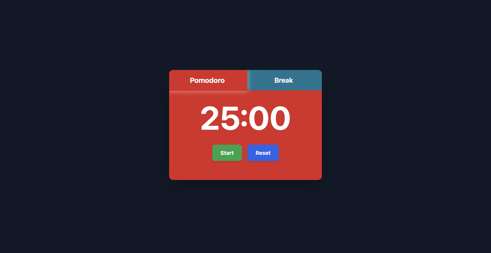

# Pomodoro Timer


A simple Pomodoro timer with basic functionality, built with HTML, CSS (Tailwind) and JavaScript.



---

## Features

- **25-minute Pomodoro Timer**
- **5-minute Break Timer**
- **Intuitive Controls**:
- Start/Pause (toggle)
- Reset
- **Automatic switching** between Pomodoro and Break modes
- **Notifications** upon completion of each session
- **Responsive design** that works on all devices
- **Smooth transitions** between modes

---

## How to Use

1. **Select the mode**:
- Click "Pomodoro" for the work session
- Click "Break" for the break

2. **Control the timer**:
- Press **Start** to start the countdown
- The button changes to **Pause** while it is running
- Use **Reset** to reset the timer to its initial state

3. **Upon completion**:
- You will receive a alert when timer expires
- Timer automatically switches to the other mode

---

## Installation

1. Clone the repository:
```bash
git clone https://github.com/your-username/pomodoro-timer.git
````

2. Start Live Server